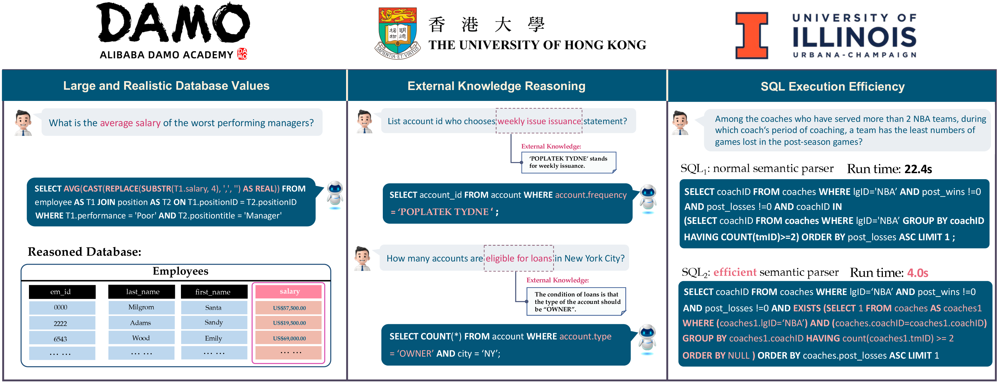
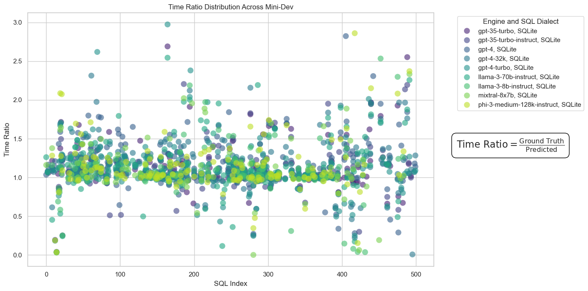

# BIRD-SQL Mini-Dev 

<p align="center">
  
</p>

<p align="center" width="100%">
  <a href="https://arxiv.org/abs/2305.03111">🔗Paper</a>
  <a href="https://bird-bench.github.io/">🏆Leaderboard</a>
<p>


[](https://creativecommons.org/licenses/by-sa/4.0/deed.en)
[](https://bird-bench.oss-cn-beijing.aliyuncs.com/minidev.zip)
[](https://www.python.org/downloads/)
[](https://bird-bench.github.io/)
[](https://pypi.org/project/openai/)
[](https://sqlite.org/download.html)
[](https://dev.mysql.com/downloads/installer/)
[](https://www.postgresql.org/download/)


<p align="center" width="100%">
<a></a>
</p>


## Overview
Here, we provide a Lite version of developtment dataset: **Mini-Dev**. This mini-dev dataset is designed to facilitate efficient and cost-effective development cycles, especially for testing and refining SQL query generation models. This dataset results from community feedback, leading to the compilation of 500 high-quality text2sql pairs derived from 11 distinct databases in a development environment. To further enhance the practicality of the BIRD system in industry settings and support the development of text-to-SQL models, we make the Mini-Dev dataset available in both **MySQL** and **PostgreSQL**.

Additionally, we introduce two new evaluation metrics for the Mini-Dev dataset: the **Reward-based Valid Efficiency Score (R-VES)** and the **Soft F1-Score**. These metrics aim to evaluate the efficiency and accuracy of text-to-SQL models, respectively. It is important to note that the both metrics, currently in their beta version, applies exclusively to the Mini-Dev dataset using baseline models.

We welcome contributions and suggestions for enhancing these metrics, particularly regarding their integration into existing leaderboards. Please do not hesitate to contact us if you are interested in these developments or have any proposals for improvements.


Below are some key statistics of the mini-dev dataset:

### Difficulty Distribution
- **Simple:** 30%
- **Moderate:** 50%
- **Challenging:** 20%

### Database Distribution
- **Debit Card Specializing:** 30 instances
- **Student Club:** 48 instances
- **Thrombosis Prediction:** 50 instances
- **European Football 2:** 51 instances
- **Formula 1:** 66 instances
- **Superhero:** 52 instances
- **Codebase Community:** 49 instances
- **Card Games:** 52 instances
- **Toxicology:** 40 instances
- **California Schools:** 30 instances
- **Financial:** 32 instances

### Keywords Statistic

- **Main Body Keywords** •SELECT •FROM •WHERE •AND •OR •NOT •IN •EXISTS •IS •NULL •IIF •CASE •CASE WHEN.
- **Join Keywords** • INNER JOIN • LEFT JOIN • ON • AS.
- **Clause Keywords** • BETWEEN • LIKE • LIMIT • ORDER BY • ASC • DESC • GROUP BY •HAVING •UNION •ALL •EXCEPT •PARTITION BY •OVER.
- **Aggregation Keywords** • AVG • COUNT • MAX • MIN • ROUND • SUM.
- **Scalar Keywords** • ABS • LENGTH • STRFTIME • JULIADAY • NOW • CAST • SUBSTR • INSTR.
- **Comparison Keywords** •= •> •< •>= •<= •!=.
- **Computing Keywords** •- •+ •* •/.

## Dataset Introduction

The dataset contains the main following resources:

- `database`: The database should be stored under the [`./mini_dev_data/dev_databases/`](./mini_dev_data/dev_databases/). In each database folder, it has two components:
  - `database_description`: the csv files are manufactured to describe database schema and its values for models to explore or references.
  - `sqlite`: The database contents in BIRD.
> [!NOTE] 
> You have to download the latest dev databases in order to construct database in the MySQL and PostgreSQL. If you use the SQLite version only, you can use the original dev databases.
- `data`: Each text-to-SQL pairs with the oracle knowledge evidence is stored as a json file, i.e., `mini_dev_sqlite.json` is stored on [`./mini_dev_data/mini_dev_sqlite.json`](./mini_dev_data/mini_dev_sqlite.json). In each json file, it has three main parts:
  - `db_id`: the names of databases
  - `question`: the questions curated by human crowdsourcing according to database descriptions, database contents.
  - `evidence`: the external knowledge evidence annotated by experts for assistance of models or SQL annotators.
  - `SQL`: SQLs annotated by crowdsource referring to database descriptions, database contents, to answer the questions accurately.
- `ground-truth SQL file`: The SQL file should be stored at [`./llm/mini_dev_data/mini_dev_sqlite_gold.sql`](./llm/mini_dev_data/mini_dev_sqlite_gold.sql).
- `llm`: It contains source codes to convert texts to SQLs by calling APIs from LLMs, such as  `GPT35-turbo-instruct`, `gpt-35-turbo`, `gpt-4`, `gpt-4-32k`, and `gpt-4-turbo`.


## Mini-Dev Dataset in MySQL and PostgreSQL


You can locate the SQL queries within the `mini_dev_mysql.json` and `mini_dev_postgresql.json` files. These queries have been transpiled from the original SQLite versions using the sqlglot package, then refined manually and with GPT-4 Turbo. After downloading the Mini-Dev dataset, each database folder will contain .sql and command.script files. Follow the instructions below to set up the database in MySQL and PostgreSQL:

### MySQL
1. Download and install the MySQL from the official website: https://dev.mysql.com/downloads/mysql/
2. Set the environment variables: 
```
export PATH=$PATH:/usr/local/mysql/bin
```
3. Start the MySQL server: 
```
sudo /usr/local/mysql/support-files/mysql.server start
```
4. Login to the MySQL server and create the database (password will be the one you set during the installation)
```bash
mysql -u root -p
CREATE DATABASE BIRD;
```
5. Construct the database by run the following command (You can find MySQL version database: `BIRD_dev.sql` in the `MINIDEV_mysql` folder):
```bash
mysql -u root -p BIRD < BIRD_dev.sql
```
6. Examples that how to run mysql query in the Python (with   pymysql) can be find in the [`examples/mysql_example.ipynb`](./examples/mysql_example.ipynb) file.

7. If you encounter the error: "this is incompatible with sql_mode=only_full_group_by", you can run the following command to disable the sql_mode:
```sql
select @@global.sql_mode;
SET GLOBAL sql_mode='{EVERYTHING SHOW IN THE ABOVE COMMAND EXCEPT ONLY_FULL_GROUP_BY}';
```

### PostgreSQL
1. Download and install the postgresql from the official website: https://www.postgresql.org/download/ 
2. Download the pgAdmin4 from the official website: https://www.pgadmin.org/download/ (Recommended to monitor the database)
3. In pgADmin4/terminal create a new database called `BIRD`
4. Construct the database by run the following command (You can find PostgreSQL version database:`BIRD_dev.sql` in the `MINIDEV_postgresql` folder):
```bash
psql -U USERNAME -d BIRD -f BIRD_dev.sql
```
5. Examples that how to run mysql query in the Python (with Psycopg) can be find in the  [`examples/postgresql_example.ipynb`](./examples/postgresql_example.ipynb) file.


## In-Context Learning (ICL):

### Environment Setup:

First, you need install openai in your python environment by:

```bash
conda create -n BIRD python=3.11.5
pip install requirements.txt
```

### Collect results

Use this script to run the OpenAI model on the Azure cloud. (you may need to adjust parameters and paths with your preference):

```bash
cd ./llm/
sh ./run/run_gpt.sh
```


## Evaluation:

### Execution (EX) Evaluation:

Please post-process your collected results as the format: SQL and its `db_id`, which is splitted by `'\t----- bird -----\t'`. The examples are shown in the [`./llm/exp_result/turbo_output/predict_mini_dev_gpt-4-turbo_cot_SQLite.json`](./llm/exp_result/turbo_output/predict_mini_dev_gpt-4-turbo_cot_SQLite.json). Put the ground-truth sql file in the [`./data/`](./data/). And you may need to design a ChatGPT tag by your own.
The main file for ex evaluation is located at [`./llm/src/evaluation_ex.py`](./llm/src/evaluation_ex.py). \
Then you could evaluate the results by the following command line :

```bash
cd ./llm/
sh ./run/run_evaluation.sh
```

### Reward-based Valid Efficiency Score (R-VES):
The main file for R-VES evaluation is located at [`./llm/src/evaluation_ves.py`](./llm/src/evaluation_ves.py).
R-VES and EX can be evaluated in the same shell, so you can eval your efficiency via:

```bash
cd ./llm/
sh ./run/run_evaluation.sh
```
(For stable R-VES, you may need to enlarge `timeout` or repeat and average results. In our test evaluation, we will enlarge `timeout` to 3 s/ex; then we repeat 5 times for VES computation, only the highest results will be reported.)

In the latest version, we adjust the VES evaluation to be more stable and reliable. Instead of simply measuring the time ratio between predict and ground-truth SQLs, we now assign reward point based on the time ratio. The R-VES are calculated as follows:
<p align="center" width="100%">
<a></a>
</p>


### Soft F1-Score Evaluation:
The main file for Soft F1-Score evaluation is located at [`./llm/src/evaluation_f1.py`](./llm/src/evaluation_f1.py). Soft-F1, VES and EX can be evaluated in the same shell, so you can eval your efficiency via:

```bash
cd ./llm/
sh ./run/run_evaluation.sh
```
#### Soft F1-Score:
Alongside the update to the Mini-Dev set, we introduced a new evaluation metric—the soft F1-score. This metric is specifically designed to assess the performance of text-to-SQL models by measuring the similarity between the tables produced by predicted SQL queries and those from the ground truth. In a nutshell, the soft F1-score is a more lenient metric that reduces the impact of column order and missing values in the tables produced by predicted SQL queries.

The following demonstrate how we calculate the soft F1-score. 

Ground truth SQL resulted table:
| Row  |  | |  
|:----------:|:----------:|:----------:|
| 1 | 'Apple' | 325 | 
| 2  | 'Orange' |  | 
| 3| 'Banana' | 119 |

Predicted SQL resulted table:
| Row |  | |  
|:----------:|:----------:|:----------:|
| 1 | 325 |'Apple' |  
| 2  | 191 |'Orange' |  
| 3| |'Banana' |

The soft F1-score is calculated as follows:

|  | Matched| Pred_only | Gold_only  |
|----------|:----------:|:----------:|:----------:|
| **Row 1** | 2 | 0 | 0 | 
| **Row 2** | 1 | 1 | 0 | 
| **Row 3** | 1 | 0 | 1 | 

* tp = SUM(Matched) = 4 
* fp = SUM(Pred_only) = 1
* fn = SUM(Gold_only) = 1
* Precision = tp / (tp + fp) = 4 / 5 = 0.8
* Recall = tp / (tp + fn) = 4 / 5 = 0.8
* F1 = 2 * Precision * Recall / (Precision + Recall) = 0.8

## Baseline performance on Mini-Dev Dataset

###  EX Evaluation
|                        | SQLite | MySQL | PostgreSQL |
|------------------------|:------:|:-----:|:----------:|
| **mixtral-8x7b**     | 21.60  | 13.60| 12.40     |
| **llama3-8b-instruct**          | 24.40  | 24.60 | 18.40      |
|**phi-3-medium-128k-instruct**            | 30.60 | 25.00 | 21.60 |
| **gpt-35-turbo-instruct** | 33.60  | 31.20 | 26.60      |
| **gpt-35-turbo**       | 38.00  | 36.00 | 27.40      |
| **llama3-70b-instruct**         | 40.80  | 37.00 | 29.40      |
| **TA + gpt-35-turbo**       | 41.60  | - | -      |
| **TA + llama3-70b-instruct**  | 42.80 | -    |-     |
| **gpt-4-turbo**        | 45.80  | 41.00 | 36.00      |
| **gpt-4-32k**        | 47.00  | 43.20 | 35.00       |
| **gpt-4**        | 47.80  | 40.80 | 35.80      |
| **TA + gpt-4-turbo**        | 58.00  | - | -      |
| **TA + gpt-4o**        | 63.00  | - | -      |


### R-VES Evaluation
|                        | SQLite | MySQL | PostgreSQL |
|------------------------|:------:|:-----:|:----------:|
| **mixtral-8x7b**     | 20.41  | 12.99 | 14.16     |
| **llama3-8b-instruct**          | 23.27  | 23.66 | 17.90      |
|**phi-3-medium-128k-instruct**| 29.54 | 24.12 | 21.07 |
| **gpt-35-turbo-instruct** | 32.28  | 30.39 | 26.14      |
| **gpt-35-turbo**       | 37.33  | 34.94 | 26.80      |
| **llama3-70b-instruct**         | 39.02  | 35.82 | 28.80      |
| **TA + gpt-35-turbo**       | 40.59  | - | -      |
| **TA + llama3-70b-instruct**  | 41.37 | -    | -      |
| **gpt-4-turbo**        | 44.79  | 39.37 | 35.23      |
| **gpt-4-32k**        | 45.29  | 42.79 | 34.59     |
| **gpt-4**        | 45.91  | 39.92 | 35.24       |
| **TA + gpt-4-turbo**        | 56.44   | - | -      |
| **TA + gpt-4o**        | 60.86  | - | -      |


### Soft F1-Score Evaluation
|                        | SQLite | MySQL | PostgreSQL |
|------------------------|:------:|:-----:|:----------:|
| **mixtral-8x7b**     | 22.95  | 13.79 | 14.70      |
| **llama3-8b-instruct**          | 27.87  | 27.49 | 19.35      |
|**phi-3-medium-128k-instruct**                | 35.33 | 28.73  | 24.11  |
| **gpt-35-turbo-instruct** | 36.34  | 33.85 | 28.30      |
| **gpt-35-turbo**       | 41.84  | 40.75 | 30.22      |
| **TA + gpt-35-turbo**       | 44.25  | - | -      |
| **llama3-70b-instruct**         | 44.38  | 40.95 | 31.43      |
| **TA + llama3-70b-instruct**  | 46.66 | -    | -      |
| **gpt-4-turbo**        | 50.08  | 45.96 | 38.36      |
| **gpt-4-32k**        | 51.92  | 47.38 | 39.55      |
| **gpt-4**        | 52.69 | 45.78 | 38.96       |
| **TA + gpt-4-turbo**        | 62.40   | - | -      |
| **TA + gpt-4o**        | 66.97  | - | -      |

### Predict SQLs
We drop the predicted SQLs of baseline models under `./llm/exp_result/sql_output_kg/` for reference.

### Time Ratio Distribution
<p align="center" width="100%">
<a></a>
</p>


## Acknowledgement
Main contributors to the Mini-Dev project: Xiaolong Li, Jinyang Li, Ge Qu, Binyuan Hui, Reynold Cheng, Chenhao Ma.

We extend our sincere gratitude to the invaluable feedbacks from the open community, including github reviewers (@freiz @nnarodytska @josem7 @wbbeyourself @ronch99 @tshu-w ) and those who reached out to us via email with their valuable suggestions.

For any questions, please contact us by bird.bench23@gmail.com.

## My To-Do List  
  
- [x] Release BIRD MINI DEV
- [x] Implement [`TA-SQL`](https://github.com/quge2023/TA-SQL) as ICL Reasoning Baseline.
- [ ] Implement more open-source LLMs.
- [x] Release cleaner dev.json.
- [ ] Release cleaner train.json.
- [ ] BIRD-SQL 2024-2025, a broad new research problem.

## Citation

Please cite the repo if you think our work is helpful to you.

```
@article{li2024can,
  title={Can llm already serve as a database interface? a big bench for large-scale database grounded text-to-sqls},
  author={Li, Jinyang and Hui, Binyuan and Qu, Ge and Yang, Jiaxi and Li, Binhua and Li, Bowen and Wang, Bailin and Qin, Bowen and Geng, Ruiying and Huo, Nan and others},
  journal={Advances in Neural Information Processing Systems},
  volume={36},
  year={2024}
}
```
